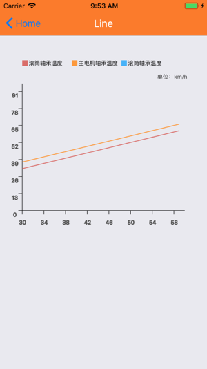
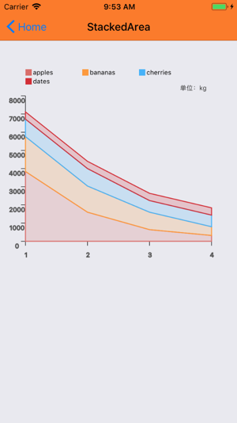
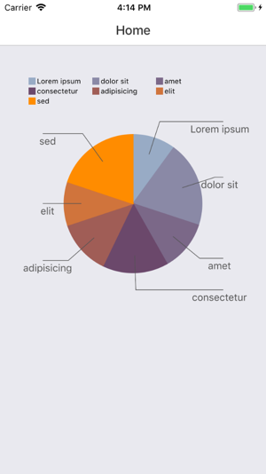
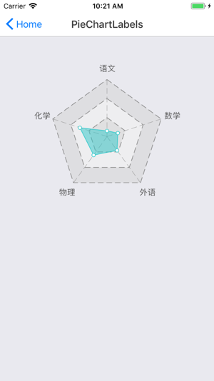

# react-native-d3-chart-example
chart with react-native-svg and d3

##### line
Support drag and zoomin-zoomout

##### stackedArea

##### PieChartLabels
Inspired by [Pie charts labels](http://bl.ocks.org/dbuezas/9306799)

##### Radia
Inspired by [基于D3.js的雷达图的实现](http://xgfe.github.io/2015/11/24/chenwubai/d3-basicCharts-radar/)

